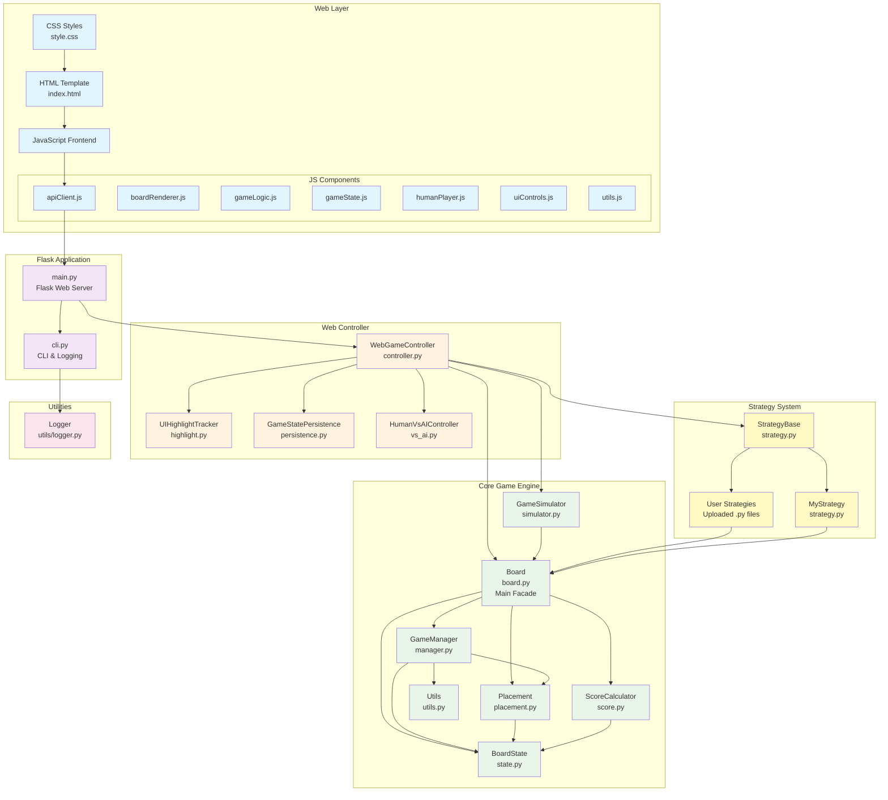

# Otheller Architecture

## システム概要

システムは、コアゲームロジック、Webインターフェース、戦略（AI）実装を分離したレイヤードアーキテクチャで構成されています。Webインターフェースを通じて、AI対AIや人間対AIの対戦モードをサポートします。

## アーキテクチャ図



## 各レイヤーの説明

### Webレイヤー

- **フロントエンドインターフェース**: HTMLテンプレート、CSSスタイル、JavaScriptコンポーネントで構成
- **JavaScriptモジュール**: API通信、盤面描画、ゲームロジック、ユーザー操作処理を担当するモジュール群

### Flaskアプリケーション

- **main.py**: ゲーム操作用のREST APIを提供するWebサーバー
- **cli.py**: コマンドラインインターフェースおよびログ出力設定

### Webコントローラー

- **WebGameController**: Web経由のゲームプレイの指揮を行う主要コンポーネント
- **UIHighlightTracker**: 手や裏返しの石をUIに反映するための追跡を行う
- **GameStatePersistence**: ゲーム状態の保存と読み込みを処理
- **HumanVsAIController**: 人間 vs AI のゲームモードを管理

### コアゲームエンジン

- **Board**: コア機能群に対する簡易インターフェースを提供するファサード
- **GameManager**: ゲーム進行、ターン管理、手の実行を統括
- **BoardState**: 8x8のゲーム盤状態を保持
- **Placement**: 手の合法性および配置ルールを検証
- **ScoreCalculator**: スコア計算と勝敗判定を行う
- **GameSimulator**: 手のプレビューなどのシミュレーション機能を提供

### 戦略（AI）システム

- **StrategyBase**: AI戦略の抽象基底クラス
- **MyStrategy**: デフォルトのAI戦略実装
- **User Strategies**: ユーザーがアップロードしたAI戦略（Pythonファイル）

### ユーティリティ

- **Logger**: 集中管理されたロギングシステム

## 主要なデザインパターン

### ファサードパターン

`Board`クラスはファサードとして機能し、複雑なゲームエンジンの機能に対する簡易インターフェースを提供します。

### ストラテジーパターン

AI戦略は`StrategyBase`を実装することで、交換可能な戦略を柔軟に差し替え可能にしています。

### 依存性注入

`WebGameController`は、専門的なコンポーネントを注入して機能を構成します。

### 状態管理

ゲームの状態は`BoardState`に集中管理され、明示的なインターフェースを通じてのみ更新されます。

## データの流れ

1. **ユーザー操作**: フロントエンドのJavaScriptがユーザーの操作を検出
2. **API通信**: APIクライアントがFlaskのエンドポイントにリクエストを送信
3. **Webコントローラー**: `WebGameController`がゲーム処理を統括
4. **コアエンジン**: `Board`ファサードが適切なコアコンポーネントに処理を委譲
5. **戦略の実行**: AI戦略が盤面状態をもとに手を選択
6. **状態更新**: コアコンポーネントがゲーム状態を更新し結果を返す
7. **UI更新**: フロントエンドが新しい状態を受け取り、画面を更新

## ファイル構成

```
otheller/
core/           # コアゲームエンジン
web/            # Webコントローラー関連
static/         # フロントエンド資産（CSS・JS）
templates/      # HTMLテンプレート
utils/          # ユーティリティ関数
main.py         # Flaskアプリケーション
cli.py          # CLIおよびロギング設定
strategy.py     # 戦略（AI）システム
```
